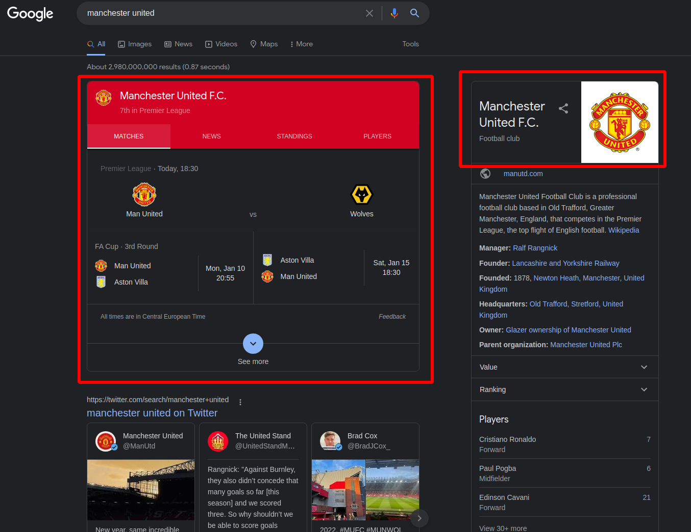

# Scraping framework for all bookies

For each bookie we open a browser window load the html and scrape it with beautiful soup. The challenge is to match
different tournaments between various bookmakers since the names of teams vary slightly. Defining a similarity metric
for matching is one option, this approach works well however sometimes it identifies a match incorrectly and that can
lead to false positive arbitrage opportunities. To make matching more robust I use Google search and the quick info
boxes provided by google

This provides a common translation of team names across different languages and different variation of team names.

All of this data is saved into a dictionary for fast lookup when saving the translated scrape data into the database.
This approach works incredibly well with zero false positive, but it falls short if the team in question doesn't have a quick
info box.

## Setup

Start the arbitrage-network with `docker network create arbitrage-network` this will allow the communication between
this container and the database in [here](https://github.com/henrichhegedus/arbitrage_site)

